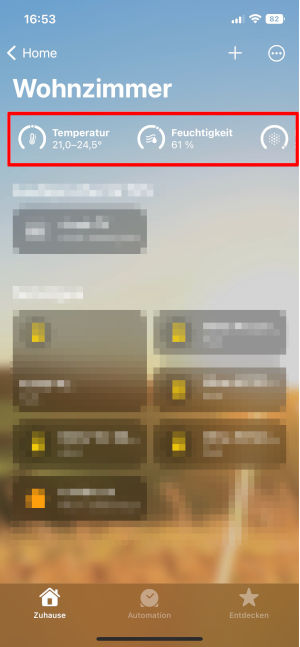
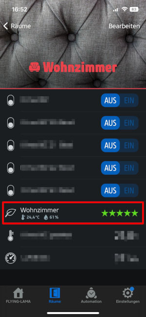
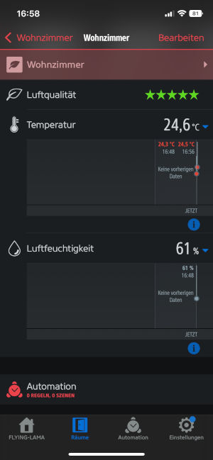

# Integrating into Homebridge

1. Install [Mqttthing](https://github.com/arachnetech/homebridge-mqttthing) plugin in [Homebridge](https://github.com/homebridge/homebridge)
1. Configure device (Add entry to "accessories" array) and restart homebridge
```json
{
    "accessories": [
        {
            "accessory": "mqttthing",
            "type": "airQualitySensor",
            "name": "living room",
            "topics": {
                "getAirQuality": "LivingRoom/RoomSensor/quality",
                "getCurrentTemperature": "LivingRoom/RoomSensor/temperature",
                "getCurrentRelativeHumidity": "LivingRoom/RoomSensor/humidity"
            },
            "history": true
        }
    ]
}
```

## Apple Home


## Eve


