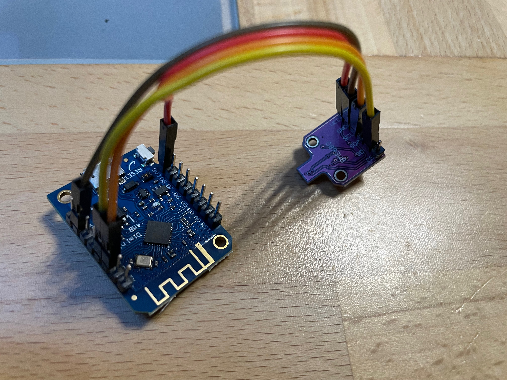
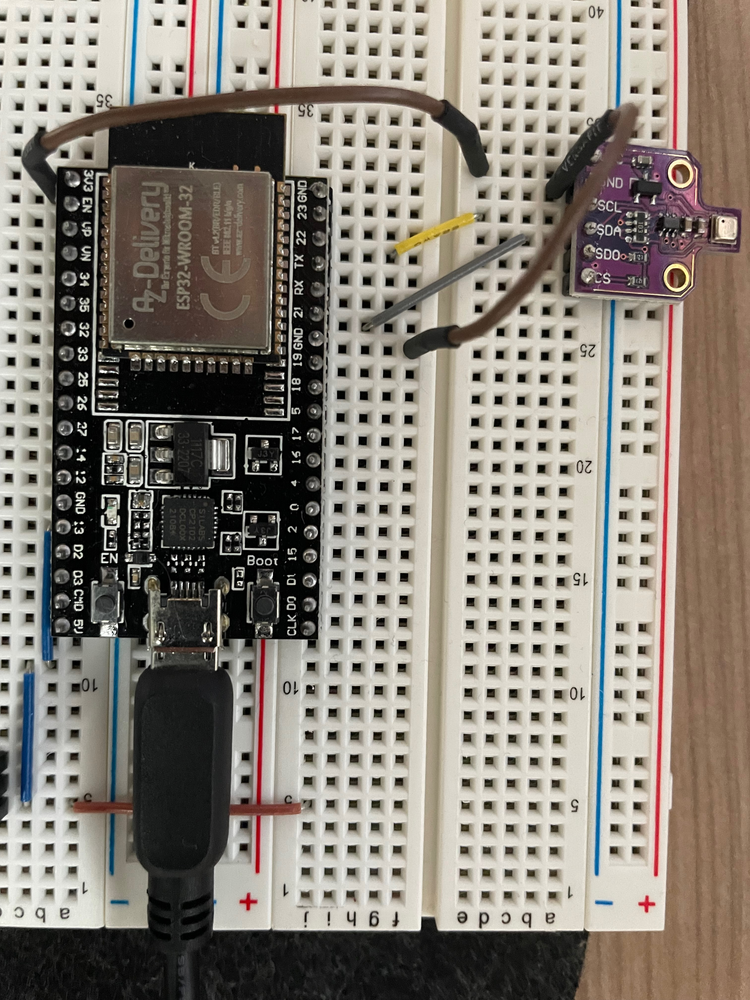

# Connect to BME680

This sketch uses I2C for communication.   

| BME680 | ESP8266 (D1 mini) | ESP32 |
|--------|-------------------|-------|
| VCC    | 3V3               | 3V3   |
| GND    | GND               | GND   |
| SCL    | D1                | 22    |
| SDA    | D2                | 21    |

